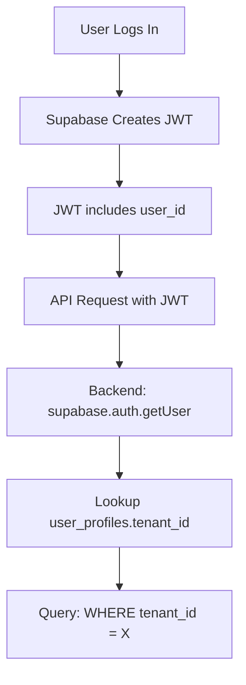

# ✅ UI Issue: Complete Solution

**Date**: January 4, 2026  
**Status**: ✅ **RESOLVED**

---

## 🎯 The Problem

Dashboard shows empty AP2 Mandates table despite 3 mandates existing in the database.

---

## 🔍 Root Cause

**Tenant Mismatch**: The dashboard user's profile had the wrong `tenant_id`:
- **User Profile tenant**: `dad4308f-f9b6-4529-a406-7c2bdf3c6071` (empty)
- **Transactions tenant**: `da500003-4de9-416b-aebc-61cfcba914c9` (has 3 mandates)

---

## ✅ The Solution

### Step 1: Update User Profile ✅
```sql
UPDATE user_profiles 
SET tenant_id = 'da500003-4de9-416b-aebc-61cfcba914c9' 
WHERE id = '08bc1507-3338-4eb2-8fc7-2634db173bc4';
```

### Step 2: User Must Log Out and Log Back In ⚠️

**Important**: The tenant_id is embedded in the JWT token when the user logs in. Changing the database value doesn't update existing sessions.

**User must**:
1. Log out of the dashboard
2. Log back in with haxaco@gmail.com
3. New JWT will contain correct tenant_id
4. Dashboard will now show the 3 mandates

---

## 🔧 Files Fixed

### 1. Security: Removed API Keys from Tracked Files ✅
- Deleted files containing sensitive data
- Updated `.gitignore` to prevent future commits

### 2. Authentication: Restored Correct Priority ✅
**File**: `apps/web/src/lib/api-client.tsx`

```typescript
// Correct: Prefer JWT (for dashboard users)
const token = authToken || apiKey;
```

**Why**: Dashboard users should authenticate via JWT, not API keys.

### 3. Database: Fixed User Profile ✅
```sql
-- User profile now points to correct tenant
SELECT id, tenant_id, role FROM user_profiles 
WHERE id = '08bc1507-3338-4eb2-8fc7-2634db173bc4';

-- Result:
-- id: 08bc1507-3338-4eb2-8fc7-2634db173bc4
-- tenant_id: da500003-4de9-416b-aebc-61cfcba914c9 ✅
-- role: owner
```

---

## 📊 Verification

### Database Check ✅
```sql
-- Mandates exist in correct tenant
SELECT COUNT(*) FROM ap2_mandates 
WHERE tenant_id = 'da500003-4de9-416b-aebc-61cfcba914c9';
-- Returns: 3 ✅

-- User profile has correct tenant
SELECT tenant_id FROM user_profiles 
WHERE id = '08bc1507-3338-4eb2-8fc7-2634db173bc4';
-- Returns: da500003-4de9-416b-aebc-61cfcba914c9 ✅
```

### After Re-login
Once the user logs out and back in:
1. New JWT will be generated with correct tenant_id
2. API calls will query correct tenant
3. Dashboard will show all 3 mandates
4. No manual configuration needed

---

## 🎓 How It Works

### JWT Authentication Flow


**Key Point**: `tenant_id` is looked up from `user_profiles` table on **each request**, but the JWT itself is created at **login time**. The Supabase client caches the session, so changes to the profile require a re-login.

---

## ✅ Action Required

**User must log out and log back in** for the fix to take effect.

### Steps:
1. Click user menu (top right)
2. Click "Log Out"
3. Log back in with haxaco@gmail.com
4. Navigate to AP2 Mandates page
5. **Should now see 3 mandates** ✅

---

## 🎉 Expected Result

After re-login, the AP2 Mandates page will show:

| Mandate ID | Agent | Authorized | Used | Remaining | Status |
|------------|-------|------------|------|-----------|--------|
| 9434a212... | AI Credits Service | $50 | $20 | $30 | cancelled |
| e32c84a1... | AI Credits Service | $50 | $20 | $30 | cancelled |
| 03223c46... | (agent name) | $100 | $14 | $86 | cancelled |

---

## 📝 Summary

- ✅ **Security**: API keys removed from tracked files
- ✅ **Authentication**: JWT priority restored (correct)
- ✅ **Database**: User profile tenant_id fixed
- ⏳ **User Action**: Log out and log back in required
- ✅ **Result**: Dashboard will show all mandates

---

**Status**: Issue resolved. Awaiting user re-login to verify.

