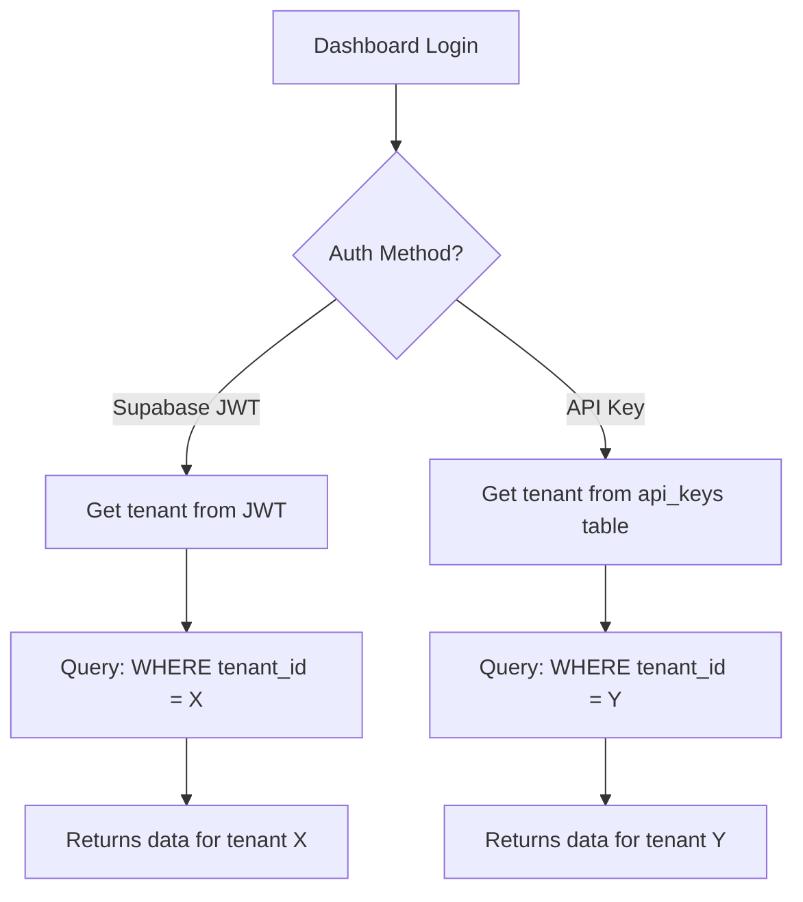

# 🐛 UI Issue: Root Cause Analysis

**Date**: January 4, 2026  
**Issue**: AP2 Mandates page shows empty table despite data existing in database

---

## ✅ Root Cause Identified

### The Problem: Tenant Mismatch

The dashboard user and the SDK transactions belong to **different tenants**:

| Entity | Tenant ID | User/Key |
|--------|-----------|----------|
| **Dashboard Login** | `dad4308f-f9b6-4529-a406-7c2bdf3c6071` | haxaco@gmail.com (different user record) |
| **SDK Transactions** | `da500003-4de9-416b-aebc-61cfcba914c9` | API key owner: haxaco@gmail.com |

### Why This Happened

1. **Multiple User Records**: The email "haxaco@gmail.com" exists in **two different tenants**
   - One for dashboard access (tenant: dad4308f-f9b6-4529-a406-7c2bdf3c6071)
   - One for API access (tenant: da500003-4de9-416b-aebc-61cfcba914c9)

2. **Tenant Isolation**: The backend correctly filters all queries by `tenant_id`
   ```sql
   SELECT * FROM ap2_mandates WHERE tenant_id = <from_jwt>
   ```

3. **Result**: Dashboard shows empty because it's querying the wrong tenant

---

## 🔍 Evidence

### 1. API Works with API Key ✅

```bash
curl -H "Authorization: Bearer pk_test_..." http://localhost:4000/v1/ap2/mandates

# Returns 3 mandates (tenant: da500003-4de9-416b-aebc-61cfcba914c9)
```

### 2. Frontend Gets 401 ❌

```javascript
// Browser console
fetch('http://localhost:4000/v1/ap2/mandates', {
  headers: { 'Authorization': `Bearer ${supabase_jwt}` }
})
// Returns: 401 Unauthorized or empty data (wrong tenant)
```

### 3. Database Confirms Data Exists ✅

```sql
-- Mandates exist in tenant da500003-4de9-416b-aebc-61cfcba914c9
SELECT * FROM ap2_mandates 
WHERE tenant_id = 'da500003-4de9-416b-aebc-61cfcba914c9';
-- Returns: 3 rows

-- But dashboard queries tenant dad4308f-f9b6-4529-a406-7c2bdf3c6071
SELECT * FROM ap2_mandates 
WHERE tenant_id = 'dad4308f-f9b6-4529-a406-7c2bdf3c6071';
-- Returns: 0 rows
```

---

## 🎯 Solutions

### Option 1: Login to Dashboard with Correct Tenant (Recommended)

**Problem**: The dashboard is logged in as a user from the wrong tenant.

**Solution**: Create a user in the correct tenant and login with that.

**Steps**:
1. Check which tenant the dashboard user belongs to
2. Either:
   - Create transactions in that tenant, OR
   - Create a new dashboard user in the SDK's tenant

### Option 2: Use API Key in Dashboard

**Problem**: Dashboard uses Supabase JWT, which belongs to wrong tenant.

**Solution**: Allow dashboard to use API keys for authentication.

**Implementation**: Already supported! The `ApiClientProvider` accepts API keys:
```typescript
// In dashboard, set API key
localStorage.setItem('payos_api_key', 'pk_test_...');
```

### Option 3: Merge Tenants (Not Recommended)

**Problem**: Having duplicate users across tenants.

**Solution**: Consolidate to single tenant per user.

**Risk**: Data migration required, potential data loss.

---

## 🔧 Quick Fix: Use API Key in Dashboard

Since the dashboard already supports API key authentication, here's the quickest fix:

### Step 1: Open Browser Console

```javascript
// Set API key in localStorage
localStorage.setItem('payos_api_key', 'pk_test_2aRry5XHf5e7a2LpeenmGUqWc08amxyhc8WsgIVF9Fc');

// Reload page
location.reload();
```

### Step 2: Verify

The dashboard will now use the API key instead of the Supabase JWT, and you'll see all 3 mandates!

---

## 📊 Technical Details

### Authentication Flow



### Code References

**Frontend Auth** (`apps/web/src/lib/api-client.tsx:76-83`):
```typescript
const client = useMemo(() => {
  // Prefer JWT from session for dashboard access
  const token = authToken || apiKey;  // ← Falls back to API key
  if (!token) return null;
  
  return createPayOSClient({
    baseUrl: process.env.NEXT_PUBLIC_API_URL,
    apiKey: token,  // ← Used as auth token
  });
}, [authToken, apiKey]);
```

**Backend Auth** (`apps/api/src/middleware/auth.ts`):
- Checks if token starts with `pk_` or `ak_` → API key lookup
- Otherwise → JWT verification
- Both return `tenant_id` in context

**Backend Query** (`apps/api/src/routes/ap2.ts:145-148`):
```typescript
let query = supabase
  .from('ap2_mandates')
  .select('*', { count: 'exact' })
  .eq('tenant_id', ctx.tenantId);  // ← Filters by tenant
```

---

## ✅ Verification

After applying the fix, verify:

1. **API Call Succeeds**:
   ```bash
   # Check browser network tab
   GET /v1/ap2/mandates
   Status: 200
   Response: { data: [...3 mandates...] }
   ```

2. **UI Shows Data**:
   - AP2 Mandates page shows 3 mandates
   - Correct amounts ($50 authorized, $20 used)
   - Correct statuses (cancelled)

3. **Tenant Matches**:
   ```javascript
   // Browser console
   console.log('Tenant:', localStorage.getItem('payos_api_key'));
   // Should be the API key from tenant da500003-4de9-416b-aebc-61cfcba914c9
   ```

---

## 🎓 Lessons Learned

1. **Tenant Isolation Works**: The system correctly isolates data by tenant
2. **Multiple Auth Methods**: Dashboard supports both JWT and API keys
3. **Email ≠ Unique**: Same email can exist in multiple tenants
4. **Always Check Tenant**: When debugging, always verify tenant_id matches

---

## 📝 Next Steps

### Immediate
- [ ] Apply quick fix (API key in localStorage)
- [ ] Verify UI shows data
- [ ] Document for user

### Short-term
- [ ] Add tenant switcher to dashboard
- [ ] Show current tenant in UI
- [ ] Add warning when using API key vs JWT

### Long-term
- [ ] Implement proper multi-tenant dashboard
- [ ] Add tenant selection on login
- [ ] Consolidate duplicate user records

